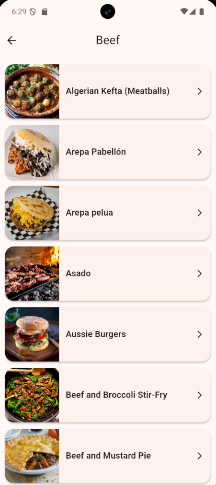
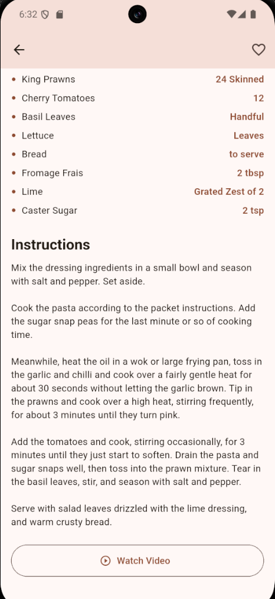
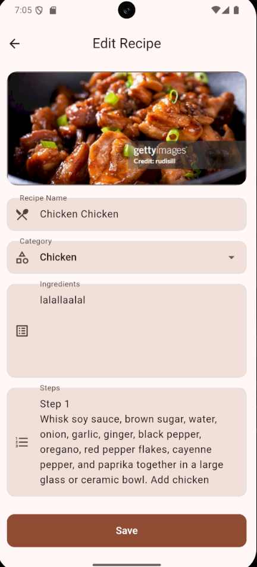
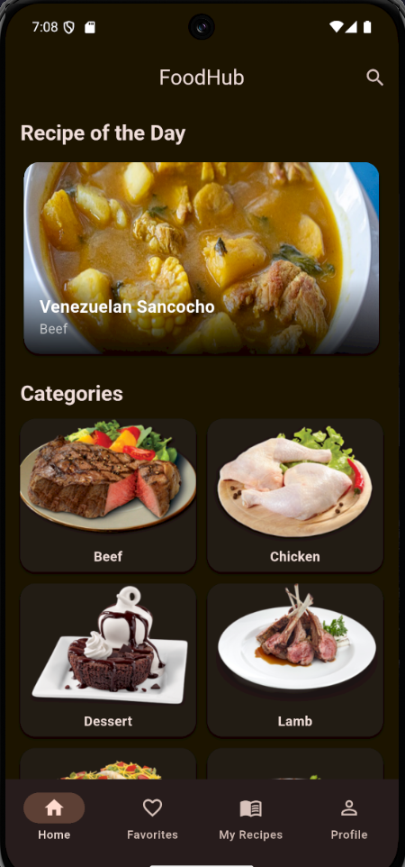
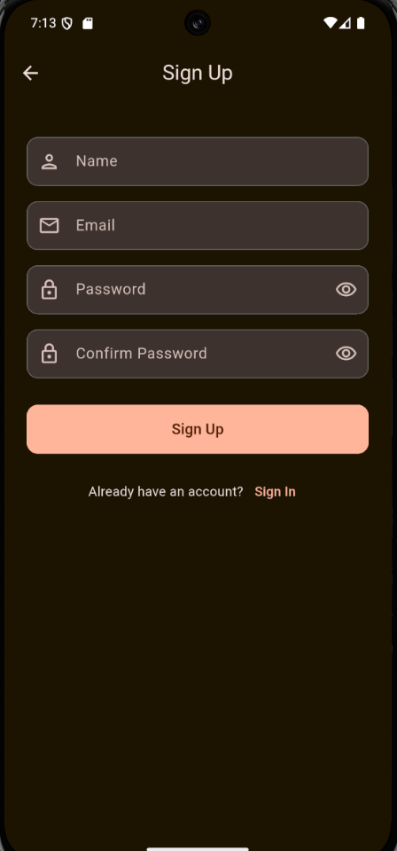
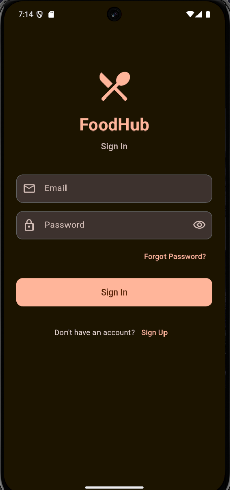
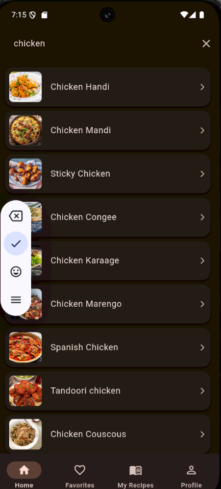

# FoodHub

Мобільний застосунок для пошуку рецептів на базі [TheMealDB API](https://www.themealdb.com/) з Firebase бекендом. Розроблено на Flutter з використанням Material Design 3.

---

## Скріншоти

| Головна | Список рецептів | Деталі рецепту |
|--------|----------------|----------------|
|  |  |  |

| Деталі рецепту 2 | Обрані | Мої рецепти |
|-----------------|--------|------------|
|  |  |  |

| Додати рецепт | Редагувати рецепт | Профіль |
|--------------|------------------|---------|
|  |  |  |

| Темна тема | Реєстрація | Вхід |
|-----------|-----------|------|
|  |  |  |

| Пошук |
|-------|
|  |

---

## Функціонал

- Перегляд рецептів по категоріях з shimmer-завантаженням та Hero-переходами
- Пошук рецептів у реальному часі з debounce
- Рецепт дня на головному екрані
- Додавання рецептів до обраних - синхронізація з Firestore у реальному часі через StreamBuilder
- Створення та редагування власних рецептів з фото (камера або галерея)
- Завантаження фото у Firebase Storage
- Профіль користувача з аватаром
- Перемикання темної/світлої теми
- Локалізація: Українська, Англійська, Польська

---

## Технічний стек

| Рівень | Технологія |
|--------|-----------|
| UI | Flutter 3.44, Material Design 3 |
| Стан | Riverpod 2 (Notifier pattern) |
| Навігація | GoRouter 14 |
| Автентифікація | Firebase Authentication |
| База даних | Cloud Firestore |
| Сховище | Firebase Storage |
| Локальне збереження | SharedPreferences |
| HTTP | Dio |
| Зображення | cached_network_image, image_picker |
| Анімації | Hero, AnimatedScale, AnimatedSwitcher, FadeTransition |
| Локалізація | Flutter Localizations (ARB) - UK / EN / PL |

---

## Архітектура

Проєкт побудований за принципом **feature-first** з розділенням на шари:

```
lib/
├── core/
│   ├── l10n/               # ARB файли локалізації + згенерований код
│   ├── providers/           # SharedPreferences провайдер
│   ├── router/              # GoRouter + MainScaffold (BottomNav)
│   └── theme/               # Material Design 3 тема (light/dark)
└── features/
    ├── auth/
    │   ├── domain/          # AuthState
    │   └── presentation/    # Login, Register, ForgotPassword + Firebase Auth
    ├── favorites/
    │   ├── data/            # FavoritesFirestoreService (CRUD)
    │   ├── domain/          # FavoriteMeal модель
    │   └── presentation/    # FavoritesScreen (StreamBuilder) + Provider
    ├── home/
    │   └── presentation/    # HomeScreen (GridView, пошук, анімації)
    ├── my_recipes/
    │   ├── data/            # MyRecipesFirestoreService (CRUD)
    │   ├── domain/          # MyRecipe модель
    │   └── presentation/    # MyRecipesScreen (StreamBuilder), Add/Edit форма
    ├── profile/
    │   └── presentation/    # ProfileScreen + Storage аватар
    ├── recipes/
    │   ├── data/            # MealApiClient (Dio), MealRepositoryImpl
    │   ├── domain/          # Моделі, MealRepository інтерфейс
    │   └── presentation/    # RecipeList, RecipeDetail + Provider
    └── settings/
        ├── domain/          # SettingsState
        └── presentation/    # SettingsNotifier (тема + мова)
```

---

## Запуск проєкту

### Вимоги

- Flutter 3.44+
- Dart 3.12+
- Android Studio або VS Code
- Firebase проєкт з увімкненими **Authentication**, **Firestore** та **Storage**

### Встановлення

```bash
git clone https://github.com/krtoxin/foodhub.git
cd foodhub
flutter pub get
```

### Налаштування Firebase

```bash
dart pub global activate flutterfire_cli
flutterfire configure
```

Команда згенерує файл `lib/firebase_options.dart` (він у `.gitignore`).

### Запуск

```bash
flutter run
```

---

## Firebase правила

**Firestore:**
```
rules_version = '2';
service cloud.firestore {
  match /databases/{database}/documents {
    match /users/{uid}/{document=**} {
      allow read, write: if request.auth != null && request.auth.uid == uid;
    }
  }
}
```

**Storage:**
```
rules_version = '2';
service firebase.storage {
  match /b/{bucket}/o {
    match /users/{uid}/{allPaths=**} {
      allow read, write: if request.auth != null && request.auth.uid == uid;
    }
  }
}
```

---

## Тести

```bash
flutter test
```

- **20 unit-тестів** - моделі: MealCategory, MealDetail, MealPreview, FavoriteMeal, MyRecipe
- **9 widget-тестів** - LoginScreen, FavoritesScreen, AddRecipeScreen

---

## Критерії реалізації

| # | Критерій | Реалізація |
|---|---------|-----------|
| 1 | UI/UX + Material Design 3 | `app_theme.dart`, light/dark теми, ColorScheme |
| 2 | GoRouter, 5+ екранів | 9 маршрутів: login, register, home, favorites, my-recipes, profile, recipe-list, recipe-detail, edit-recipe |
| 3 | GridView/ListView + пошук + pull-to-refresh | GridView категорій, ListView рецептів, debounce пошук |
| 4 | Form + GlobalKey + валідація | `add_recipe_screen.dart`, autovalidateMode |
| 5 | Реальний API + Repository pattern | TheMealDB через Dio, `MealRepository` інтерфейс |
| 6 | SharedPreferences | `settings_provider.dart` - тема і мова |
| 7 | Riverpod 3+ провайдери | 10+ провайдерів: auth, favorites, my_recipes, settings, recipes, search, тощо |
| 8 | Анімації 2 типи | Hero (перехід між екранами), AnimatedSwitcher (серце), AnimatedScale |
| 9 | Локалізація UK/EN/PL | ARB файли, 70+ рядків на кожну мову |
| 10 | Тести 5 unit + 3 widget | 20 unit + 9 widget |
| 11 | Camera + Gallery + Storage | image_picker + Firebase Storage (рецепти та аватар) |
| 12 | Firebase Auth | signIn, signUp, signOut, resetPassword, updatePhotoURL |
| 13 | Firestore CRUD + StreamBuilder | Create/Read/Update/Delete в `users/{uid}/favorites` та `users/{uid}/my_recipes` |
| 14 | README + GitHub | Цей файл |
