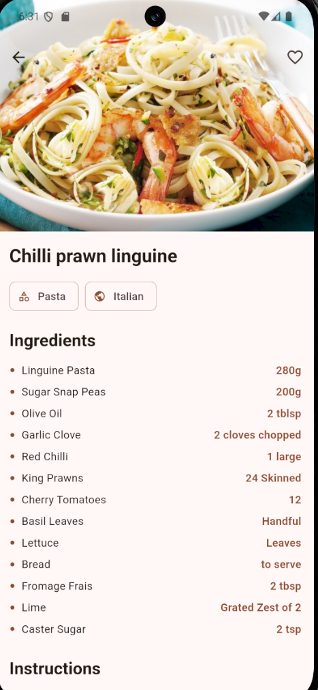
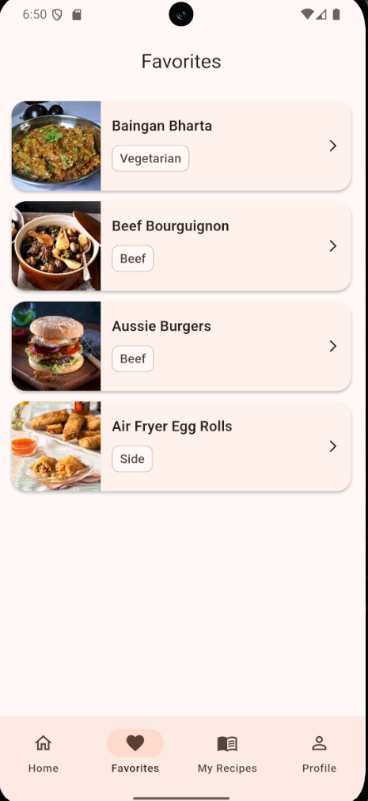
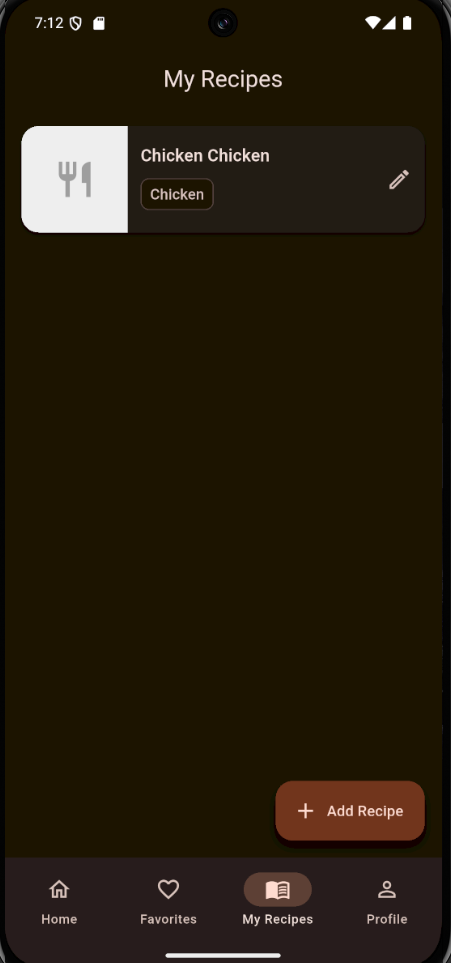
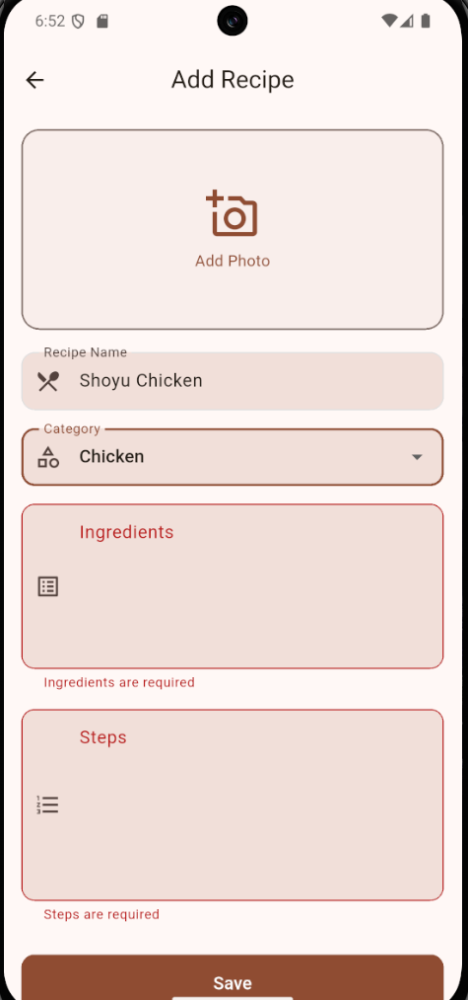
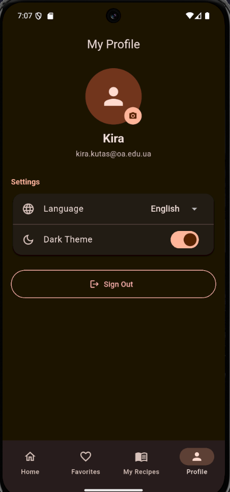

# FoodHub

A Flutter recipe app powered by [TheMealDB](https://www.themealdb.com/) API with Firebase backend.

## Features

- Browse recipes by category with shimmer loading and Hero transitions
- Search recipes in real time with debounce
- Recipe of the day on the home screen
- Add recipes to favorites - synced live with Firestore
- Create your own recipes with photo from camera or gallery (uploaded to Firebase Storage)
- Profile screen with avatar upload to Firebase Storage
- Dark / light theme toggle
- Localization: Ukrainian, English, Polish

## Screenshots

| Home | Recipe Detail | Favorites |
|------|--------------|-----------|
|  |  |  |

| My Recipes | Add Recipe | Profile |
|------------|-----------|---------|
|  |  |  |

## Tech Stack

| Layer | Technology |
|-------|-----------|
| UI | Flutter 3.44, Material Design 3 |
| State | Riverpod 2 (Notifier pattern) |
| Navigation | GoRouter 14 |
| Auth | Firebase Authentication |
| Database | Cloud Firestore |
| Storage | Firebase Storage |
| Local cache | SharedPreferences |
| HTTP | Dio |
| Images | cached_network_image, image_picker |
| Animations | Hero, AnimatedScale, AnimatedSwitcher, FadeTransition |
| i18n | Flutter Localizations (ARB) - UK / EN / PL |

## Getting Started

### Prerequisites

- Flutter 3.44+
- Dart 3.12+
- Android Studio or VS Code
- A Firebase project with **Authentication**, **Firestore**, and **Storage** enabled

### Setup

```bash
git clone https://github.com/krtoxin/foodhub.git
cd foodhub
flutter pub get
```

Configure Firebase (generates `lib/firebase_options.dart`):

```bash
dart pub global activate flutterfire_cli
flutterfire configure
```

Run on a connected device or emulator:

```bash
flutter run
```

### Firebase rules (Firestore)

```
rules_version = '2';
service cloud.firestore {
  match /databases/{database}/documents {
    match /users/{uid}/{document=**} {
      allow read, write: if request.auth != null && request.auth.uid == uid;
    }
  }
}
```

### Firebase rules (Storage)

```
rules_version = '2';
service firebase.storage {
  match /b/{bucket}/o {
    match /users/{uid}/{allPaths=**} {
      allow read, write: if request.auth != null && request.auth.uid == uid;
    }
  }
}
```

## Project Structure

```
lib/
├── core/
│   ├── l10n/          # ARB localization files + generated code
│   ├── providers/     # SharedPreferences provider
│   ├── router/        # GoRouter + MainScaffold
│   └── theme/         # Material Design 3 theme
└── features/
    ├── auth/          # Login, Register, Forgot Password + Firebase Auth provider
    ├── favorites/     # Favorites list + Firestore service
    ├── home/          # Home screen with category grid
    ├── my_recipes/    # User recipes + Firestore service + Storage upload
    ├── profile/       # Profile screen + Storage avatar upload
    ├── recipes/       # MealDB API client, repository, screens
    └── settings/      # Theme + language settings
```

## Tests

```bash
flutter test
```

- 20 unit tests - models (MealCategory, MealDetail, MealPreview, FavoriteMeal, MyRecipe)
- 9 widget tests - LoginScreen, FavoritesScreen, AddRecipeScreen
